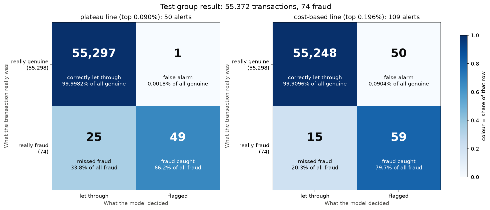

# Credit Card Fraud Detection

A fraud detection model built on the public credit card transactions dataset
released by the Machine Learning Group of the Université Libre de Bruxelles
(ULB) together with Worldline: two days of real, anonymized card
transactions, in which fraud is extremely rare.

## Results at a glance

**The problem:** fraud is about 1 in 600 transactions, and a bank's fraud
team can only review a small number of alerts. A useful model has to put
real fraud at the very top of its list of suspicious transactions, without
burying the team in false alarms.

**The model:** XGBoost with class weighting (each fraud case counted about
568 times while learning, so the rare class isn't ignored), standard
settings, using 29 features: the 28 anonymized columns `V1` to `V28` plus
the scaled transaction `Amount`.

**The honest result**, on the latest 20% of the data, held back and scored
once at the very end (55,372 transactions, 74 fraud):

- **The top of the list was all real fraud.** The headline measure, AUCPR
  over the low-recall range (precision among the model's most confident
  alerts), was 1.00: the first 37 alerts, half of all the fraud, contained
  no false alarm.
- **With the main cutoff (flag the top 0.090%):** 50 alerts, 49 of them real
  fraud, catching 49 of the 74 frauds (66%) with **1 false alarm**.
- **With a cost-based cutoff (flag the top 0.196%):** 109 alerts, catching
  59 of 74 (80%) with 50 false alarms, at the lowest total cost under stated
  cost assumptions.



**How it was kept honest:**
- **Split by time, never randomly:** every choice was made with
  walk-forward validation on the earliest 80% of the data.
- **Test group used once:** the latest 20% was touched once, to report the
  result.
- **No winner from a single number:** every comparison uses bootstrap
  confidence intervals, so a winner is only declared when the difference
  is more than noise.
- **Limits stated:** see [Limitations](#limitations) and
  [Fairness](#fairness-what-this-project-cannot-check).

The **[model card](docs/model_card.md)** summarises the model on one page:
what it is for and not for, how it was tested, its results, limitations,
and the dataset's license and privacy.

## How the project got there

Each section below is one phase of the project, with its notebook, real
results and saved charts.

## Cleaning (Phase 1)

From `notebooks/01_data_cleaning.ipynb`; every check was run on the real
data. Every column is described in
[docs/data_dictionary.md](docs/data_dictionary.md).

- **A stable `row_id` was added first,** from the original row order, so
  any transaction can always be traced back to the raw file.
- **No missing values;** no negative amounts. The 1,825 transactions with
  an Amount of exactly zero are kept: they are real records, and 27 of them
  are fraud.
- **1,081 extra copies of exact duplicate rows removed** (one copy of each
  kept). They were checked by class first: 19 of the removed copies were
  fraud, but every fraud transaction still keeps one copy, and no
  duplicate pair disagreed on whether it was fraud.
- **The cleaned data:** 283,726 transactions, of which 473 are fraud,
  **0.1667%**, about 1 in every 599 (recalculated after cleaning).

## What the data looks like (Phase 2)

All from `notebooks/02_exploration.ipynb`, on the cleaned data.

- **Fraud is rare:** 473 of 283,726 transactions (0.17%), about 1 in 599.
  [Chart](outputs/figures/01_class_balance.png)
- **Amount is heavily right-skewed** (skewness 16.98): median 22.00, mean
  88.47, largest 25,691.16. By the IQR rule, 11.17% of transactions are
  unusually large (above 185.38); they are real purchases and are kept.
  [Distribution](outputs/figures/02_amount_distribution.png),
  [boxplot](outputs/figures/03_amount_boxplot.png)
- **Transactions follow a daily cycle,** with the quietest hours exactly 24
  hours apart. **Fraud does not:** its share rises to about 1.3% to 1.6% of
  transactions in the quiet hours, against 0.17% overall. The data's clock
  time is unknown, so the quiet hours are only *probably* night-time; "night"
  below is used in that sense.
  [Chart](outputs/figures/04_time_distribution.png)
- **Fraud looks different in Amount, but not simply "bigger":** a lower
  median than genuine (9.82 vs 22.00) and a higher mean (123.87 vs 88.41),
  with non-overlapping 95% bootstrap confidence intervals for both. Fraud
  has more exactly-zero amounts and more large ones.
  [Chart](outputs/figures/05_amount_by_class.png),
  [table](outputs/tables/amount_by_class.csv)
- **The anonymized V1 to V28 columns are uncorrelated with each other**
  (largest correlation 0.019 across all 378 pairs), as PCA output should be.
  [Heatmap](outputs/figures/06_v_correlation_heatmap.png)

## How the data is split (Phase 3)

From `notebooks/03_time_split.ipynb`. The data is split **by time, never
randomly**, because fraud patterns change over time and a random split
would let a model learn from the future.

| Part | Rows | Fraud | Used for |
|---|---|---|---|
| Development data (earliest 80%) | 226,980 | 399 | every choice, via walk-forward validation |
| Test group (latest 20%) | 56,746 | 74 | the final result, looked at once, at the end |

- **Walk-forward validation:** the development data is cut into 5
  time-ordered blocks. In each of 4 rounds a model learns from all earlier
  blocks and is checked on the next, so choices are judged on 250 fraud
  cases while never peeking at the future. A first single 60/20/20 split
  was replaced because its validation group held only 57 fraud cases.
- **Clean boundaries:** transactions from the same second always stay
  together, and the first 10 minutes after each boundary are not scored,
  so a burst of fraud can't be learned on one side and scored on the
  other. For the test group this leaves **55,372 scored transactions** of
  its 56,746 (all 74 fraud cases are among them); that is the number used
  in the results below.
- **The fraud rate changes over time:** from 0.10% to 0.31% across blocks,
  highest in the two blocks containing night-time stretches. The first
  block's rate (0.31%) is higher than every other part's, and the second
  night block's (0.20%) higher than its two daytime neighbours', with
  non-overlapping 95% bootstrap confidence intervals; the other
  differences may be noise.
  [Chart](outputs/figures/07_fraud_rate_over_time.png)

## Handling the class imbalance (Phase 4)

From `notebooks/04_imbalance.ipynb`, on the development data only. Four
techniques were compared, each in all four walk-forward rounds with the
same simple model (Logistic Regression), fitted on each round's learning
blocks only and judged on the pooled check blocks (250 fraud cases).

- **Metric:** AUCPR over recall 0 to 0.2 (how precise the model is among
  its most confident flags, the part a fraud team with limited time
  actually uses), with average precision over the whole curve as a
  pre-declared tie-breaker.
- **Comparison test:** 95% bootstrap confidence intervals of the paired
  difference between two techniques scored on the same transactions.
- **Result: no single clear winner.** ADASYN was clearly worse on the main
  metric, Borderline-SMOTE clearly worse on average precision, and SMOTE
  and class weighting were tied on both. No technique won every round.
  Contrary to what the literature would suggest, neither Borderline-SMOTE
  nor ADASYN beat plain SMOTE on this data.
- **Carried forward: class weighting**, as a practical tie-break between
  two equally good options: it creates no synthetic data and keeps
  training fast.
- **Data leakage shown on purpose:** fitting SMOTE before separating the
  learning and check data inflated average precision by 0.018, a real
  difference (95% interval +0.006 to +0.032) with no real improvement
  behind it.

Results: [by round](outputs/tables/imbalance_by_round.csv),
[pooled](outputs/tables/imbalance_pooled.csv),
[paired differences](outputs/tables/imbalance_paired_differences.csv).

## Comparing models (Phase 5)

From `notebooks/05_models.ipynb`, on the development data only, with
class weighting and the same walk-forward rounds for every model. The
shared steps live in `src/walk_forward.py`, so every model runs exactly
the same code.

- **Three models, standard settings:** Logistic Regression, Random Forest
  and XGBoost, each with reasonable, explained default settings rather
  than a search for the best ones. With only 250 fraud cases to judge on,
  tuning would partly fit those particular cases. These results show
  standard-setting performance, not each model's ceiling.

| Model | AUCPR, recall 0 to 0.2 (95% CI) | Average precision (95% CI) |
|---|---|---|
| Logistic Regression | 0.997 (0.983 to 1.000) | 0.692 (0.631 to 0.749) |
| Random Forest | 0.960 (0.896 to 0.998) | 0.758 (0.698 to 0.810) |
| XGBoost | 0.969 (0.912 to 1.000) | 0.753 (0.694 to 0.804) |

- **Result:** all three are tied on the main metric (no paired difference
  proven). On average precision, XGBoost and Random Forest are genuinely
  ahead of Logistic Regression overall, though not in every round: in one
  later round Logistic Regression was genuinely better. XGBoost and
  Random Forest could not be told apart.
- **Chosen: XGBoost**, as a practical tie-break with Random Forest: its
  scores are smooth (useful for choosing a decision threshold), it was best
  or tied on the main metric in every round, and it is fast.
- **Scaling Amount** didn't measurably change performance, but without it
  Logistic Regression failed to finish learning in three of four rounds,
  so it is kept.
- **An hour-of-day feature** (fraud's share rises at night) was tested and
  **left out**: it didn't measurably improve XGBoost. `Time` itself is not
  a feature either, so the model uses 29 features: `V1` to `V28` and
  `Amount`.

Results: [by round](outputs/tables/models_by_round.csv),
[pooled](outputs/tables/models_pooled.csv),
[paired differences](outputs/tables/models_paired_differences.csv),
[hour-of-day test](outputs/tables/hour_of_day_paired_differences.csv).

## The final result (Phase 6)

From `notebooks/06_final_evaluation.ipynb`. The final model (XGBoost,
class weighting, standard settings, 29 features) was trained once on all
the development data, then scored **once** on the locked test group: the
latest 20% of the data, 55,372 scored transactions with 74 fraud cases,
never used for any decision. Nothing was changed after seeing the result.

| Metric (test group) | Result | 95% confidence interval |
|---|---|---|
| **AUCPR over recall 0 to 0.2 (headline)** | **1.00** | 1.00 to 1.00 |
| Average precision (whole curve) | 0.80 | 0.71 to 0.88 |

- **What the headline means:** working down the model's list of most
  suspicious transactions, every top alert was real fraud. In fact the
  first 37 alerts, half of all the fraud, contained no false alarm. The
  interval is a single point because the metric is at its ceiling; that
  means no top alert was wrong in this test period, not that the model is
  certain to be perfect on new data.
- **Why accuracy isn't used:** a model that calls everything genuine
  scores 99.87% accuracy on this test group while catching no fraud.
- **The cost of catching everything:** 80% of the fraud takes 117 alerts
  (about half of them real fraud); all 74 take 22,970 alerts, because the
  last few fraud cases look completely ordinary to the model.
  [Alert depth table](outputs/tables/test_alert_depth.csv),
  [precision-recall curve](outputs/figures/08_precision_recall_curve_test.png)
- **Against the walk-forward estimate** (0.97 headline, 0.75 average
  precision): the test scores are higher, but the confidence intervals
  overlap, so they are consistent rather than proven different.

## From risk score to decision (Phase 7)

From `notebooks/07_threshold.ipynb`. The model gives every transaction a
risk score; a **cutoff** turns that into a yes/no decision (flag it for
the fraud team, or let it through). Both cutoffs below were chosen on the
walk-forward check blocks only, expressed as "flag the top X% most
suspicious transactions", then applied **once** to the saved test scores.

- **Main cutoff: flag the top 0.090%.** On the check blocks, alerts stay
  93% to 96% real fraud until about 60% of the fraud is found, then
  precision falls off a cliff between 70% and 80%. This line sits at the
  end of that stable stretch, with a safety margin.
  [Precision-recall curve](outputs/figures/09_precision_recall_curve_check_blocks.png),
  [depth table](outputs/tables/check_blocks_alert_depth.csv)
- **Cost-based cutoff: flag the top 0.196%.** Under stated business
  assumptions (a missed fraud costs its Amount + 20, a false alarm 8, a
  caught fraud 3 for review time), this is where total cost is lowest on
  the check blocks. These costs are assumptions, not bank data.
  [Cost curve](outputs/figures/10_cost_curve_check_blocks.png),
  [table](outputs/tables/cost_based_cutoff_check_blocks.csv)

**Test group result** (55,372 transactions, 74 fraud; 95% bootstrap
intervals in brackets):

| | Main cutoff (top 0.090%) | Cost-based (top 0.196%) | Flag nothing |
|---|---|---|---|
| Alerts | 50 | 109 | 0 |
| Fraud caught / missed | 49 / 25 | 59 / 15 | 0 / 74 |
| False alarms | 1 | 50 | 0 |
| Precision | 0.98 (0.93 to 1.00) | 0.54 (0.45 to 0.63) | — |
| Recall | 0.66 (0.56 to 0.76) | 0.80 (0.71 to 0.88) | 0 |
| MCC | 0.81 (0.73 to 0.87) | 0.66 (0.58 to 0.73) | — |
| Total cost | 4,579 (1,743 to 8,316) | 2,641 (973 to 5,433) | 9,208 |

- **Both cutoffs held up on unseen data**, close to what the check blocks
  predicted (main: 60% caught at 94% precision on the check blocks, 66% at
  98% on test; cost-based: 79% at 57%, then 80% at 54%).
- **The trade-off:** the cost-based line catches 10 more frauds at the
  price of 49 more false alarms. Total cost intervals are wide, because
  cost depends mostly on the Amounts of a few missed frauds.
- **The best cost-based line moves with the fraud rate** (from 0.09% to
  0.48% of transactions across the walk-forward rounds). In a real
  deployment, the fraud rate and alert queue should be monitored weekly
  and the line re-tuned regularly.
  [Confusion matrices](outputs/figures/11_confusion_matrix_test.png),
  [results](outputs/tables/test_final_cutoffs.csv),
  [intervals](outputs/tables/test_final_cutoffs_intervals.csv)

## What the model pays attention to (Phase 8)

From `notebooks/08_shap.ipynb`, using **SHAP** on the final model over
the development data (all 226,980 transactions; the test group was not
used again). For each transaction, SHAP measures how much each feature
pushed the model's score towards fraud or towards genuine; the pushes add
up exactly to the model's score (checked, and matched against XGBoost's
own calculation).

- **V14 matters far more than any other feature:** 16% of all pushing,
  and on fraud transactions three times the next feature. Low V14 values
  push strongly towards fraud. V14, V4, V12 and V10 together do 40% of
  the work. [Summary chart](outputs/figures/12_shap_summary.png),
  [ranking](outputs/figures/13_shap_importance_bar.png),
  [table](outputs/tables/shap_feature_importance.csv)
- **What V14 means can't be said:** the V columns are anonymized, so SHAP
  shows *that* they matter, not what real-world behaviour they stand for.
  SHAP also explains the model, not the causes of fraud.
- **Amount** is 6th of 29, a supporting feature rather than a leading one.
  Middle amounts (10 to 100) push towards genuine; exactly-zero and large
  amounts push towards fraud, matching where fraud is actually more
  common. Its largest pushes all go to frauds of exactly 99.99, which may
  be one repeated attack the model partly remembers.
  [Chart](outputs/figures/14_shap_amount_dependence.png),
  [by band](outputs/tables/shap_amount_by_band.csv)
- **Time** is not one of the model's features, so SHAP says nothing about
  it directly. The model is still slightly more suspicious of genuine
  transactions in the night hours where fraud peaks, a pattern that
  reaches it through the V columns; the effect is small.
  [Chart](outputs/figures/15_scores_by_hour.png),
  [by hour](outputs/tables/scores_by_hour.csv)

The notebook separates what the SHAP numbers show from what is only a
reasonable guess (for example, that zero amounts reflect card testing).

## Limitations

- **Two days of data.** Every result comes from about 48 hours of
  transactions, from one source. Whether the patterns hold over weeks or
  months, or for another bank, is unknown.
- **Few fraud cases to measure with.** The final result rests on 74 test
  fraud cases, and every choice on 250 check-block fraud cases. That is
  why every number comes with a confidence interval, and some of those
  intervals are wide.
- **Anonymized features.** `V1` to `V28` can't be interpreted, so the
  model's reasoning can be measured (Phase 8) but not explained in
  real-world terms.
- **No search for the best settings,** on purpose: with so few fraud cases
  to judge on, tuning would partly fit those particular cases. The results
  show standard-setting performance, not the best these models could do.
- **The cost figures are assumptions,** not real bank data, so the
  cost-based cutoff is only as good as those assumptions.
- **The fraud score ranks suspicion; it isn't the real chance of fraud.**
  Class weighting pushes scores upwards; how far they differ from real
  chances was not measured.
- **Possible memorising of one attack:** 27 development frauds share an
  Amount of exactly 99.99, and the model gives that amount its largest
  Amount pushes; a different attacker would not trigger them.
- **Cutoffs are shares of a batch.** Both cutoffs flag the top share of a
  set of transactions, so they suit scoring a day's worth at once, not
  single transactions one by one, and the best cost-based share moves with
  the fraud rate.

## Fairness: what this project cannot check

A fair fraud model should not flag some groups of people (for example by
age, gender, ethnicity, or where they live) far more often than others for
the same behaviour. **This project cannot check for that.**

The dataset contains no usable personal or demographic information. The
only readable columns are `Time`, `Amount`, and `Class`; everything else
(`V1` to `V28`) was anonymized by the dataset's creators using PCA, which
blends the original details together so they can't be recovered. Whatever
personal details went into those columns, we can't see them, so we can't
measure whether the model treats any group differently.

That does not mean the model is fair, only that its fairness is unknown.
Anonymized features can still carry patterns linked to who someone is,
and even `Amount` or the timing of purchases can differ between groups.
A real deployment of a model like this would need a proper fairness audit,
using data that includes the relevant characteristics, handled under
appropriate privacy safeguards. That audit is outside what this dataset
makes possible.

## Using the trained model

The final model is saved in this repository as
`outputs/models/fraud_model.joblib` (about 249 KB): the Amount scaling
learned from the development data and the XGBoost model together, as one
scikit-learn pipeline, so new data is always prepared exactly as in
training. No retraining is needed to use it. (Only load model files you
trust: loading a joblib file can run code stored inside it.)

**To score transactions** (after the setup steps below):

```
.venv\Scripts\python.exe src\predict.py transactions.csv predictions.csv
```

- **Input:** a CSV with columns `V1` to `V28` and `Amount`, in any order.
  Other columns are ignored, except `row_id`, which is copied to the
  output.
- **Output:** one row per transaction: `fraud_score` (0 to 1, higher is
  more suspicious), `rank` (1 = most suspicious in the file) and `flagged`
  (the top 0.090% of the file, the main cutoff). Add
  `--cutoff cost-based` to flag the top 0.196% instead.
- **Batches only:** because flags are a share of the file, use it on a
  batch of transactions such as a day's worth; it warns when a file is too
  small for the rule to mean anything.

**To rebuild the model** from the development data:
`.venv\Scripts\python.exe src\train.py`. Before saving, it checks that the
rebuilt model gives exactly the same scores as the model evaluated in the
notebooks.

## How to rerun this project

The commands are for Windows, as used to build the project. On macOS or
Linux, use `.venv/bin/python` in place of `.venv\Scripts\python.exe`.

1. **Get the code** (needs [git](https://git-scm.com/)):
   ```
   git clone https://github.com/revathyh95-harichandran/credit-card-fraud-detection.git
   cd credit-card-fraud-detection
   ```
   or use GitHub's green **Code → Download ZIP** button and unzip it.
2. **Python:** the project was built and run with Python 3.14.7.
3. **Set up a private environment and the exact library versions** (all
   pinned in `requirements.txt`), from the project folder:
   ```
   python -m venv .venv
   .venv\Scripts\python.exe -m pip install -r requirements.txt
   ```
4. **Get the data** (see [Getting the data](#getting-the-data)), so that
   `data/raw/creditcard.csv` exists. Notebook 01 reads it from there and
   never changes it.
5. **Run the notebooks in order, 01 to 08.** Each one uses files written
   by the ones before it (for example, notebook 03 writes the development
   and test files every later notebook reads). To run one from start to
   finish and save its outputs:
   ```
   .venv\Scripts\python.exe -m nbconvert --to notebook --execute --inplace notebooks\01_data_cleaning.ipynb
   ```
   then the same for `02_exploration`, `03_time_split`, `04_imbalance`,
   `05_models`, `06_final_evaluation`, `07_threshold` and `08_shap`. Every
   chart and table is rewritten in `outputs/`. Using `python -m nbconvert`
   with the environment's own Python makes sure the notebooks run with the
   pinned libraries.
6. **Optionally,** rebuild the saved model with `src\train.py` (above).

**A note on the test group:** re-running notebook 06 scores the test group
again. The model is reproducible, so the scores come out identical (checked
during the project by comparing the saved scores file before and after a
re-run): a re-run repeats the same measurement and changes no decision.

## Project structure

```
data/                   (not in git; see "Getting the data")
  raw/                  original download, never modified
  staging/              in-between files: the data with row_id added, removed
                        duplicates, the saved test scores, prediction demos
  processed/            cleaned data, and the development and test files
notebooks/
  01_data_cleaning      cleaning checks and the cleaned file
  02_exploration        first look at the data, charts 01-06
  03_time_split         time-based split and walk-forward blocks, chart 07
  04_imbalance          SMOTE, Borderline-SMOTE, ADASYN, class weighting
  05_models             Logistic Regression, Random Forest, XGBoost
  06_final_evaluation   the final model, scored once on the test group
  07_threshold          choosing the cutoffs; confusion matrix
  08_shap               explaining the model with SHAP
src/
  walk_forward.py       shared steps used by notebooks 05-08 and train.py
  train.py              trains and saves the final model
  predict.py            scores new transactions with the saved model
outputs/
  figures/              every chart, saved as an image file
  tables/               summary tables, saved as CSV files
  models/               the final trained model (fraud_model.joblib)
docs/                   the data dictionary and the model card
requirements.txt        exact library versions
```

## Getting the data

The dataset is not included in this repository. Download it from Kaggle:
[Credit Card Fraud Detection](https://www.kaggle.com/datasets/mlg-ulb/creditcardfraud),
and place the downloaded `archive.zip` in `data/raw/`. Unzip it there to get
`creditcard.csv`. Its creators describe it as transactions made by
European cardholders over two days in September 2013, and its Kaggle page
lists it under the Open Data Commons Database Contents License (DbCL)
v1.0.

## License

The code and documentation in this project are released under the MIT
License, see [LICENSE](LICENSE). The dataset is not covered by this license;
it belongs to its creators and has its own terms.
